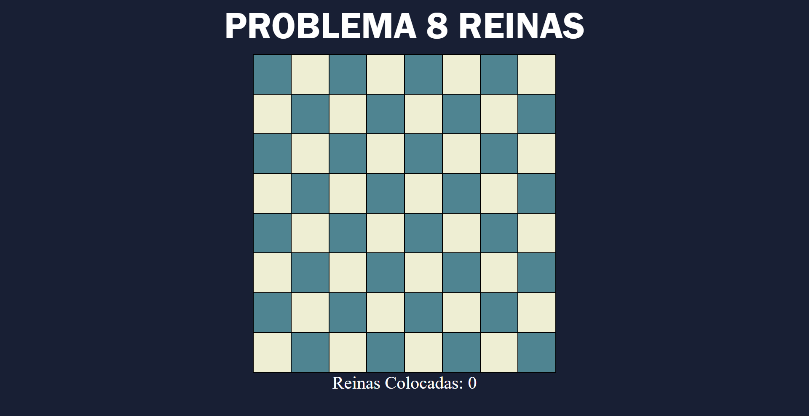
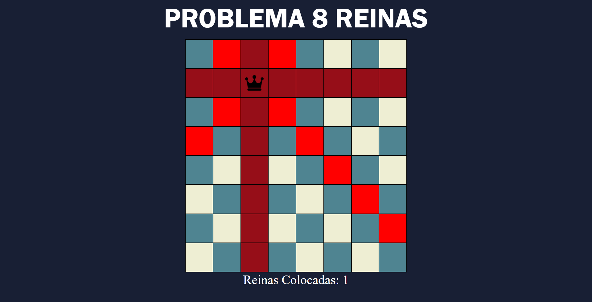
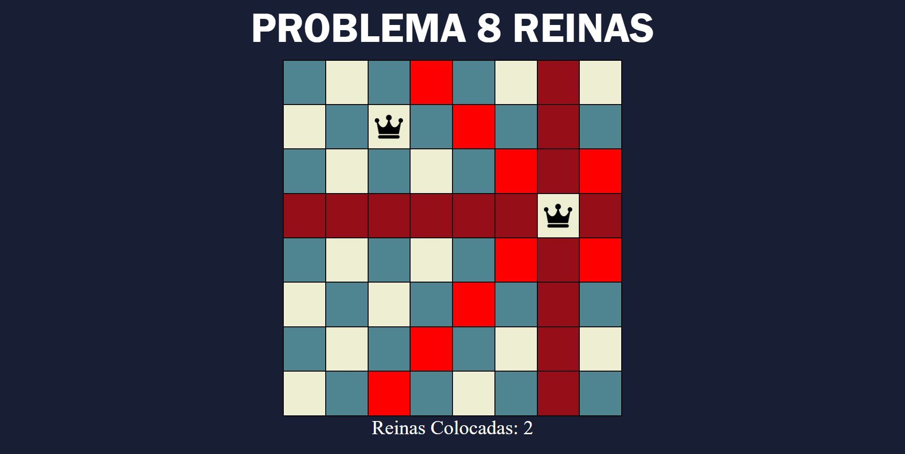
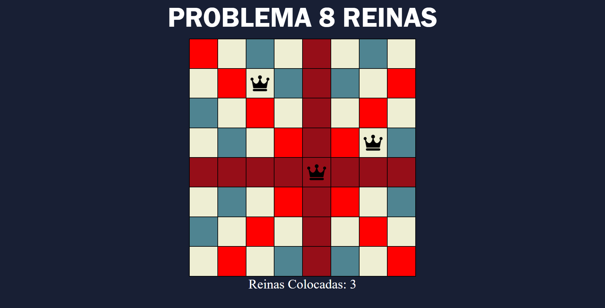
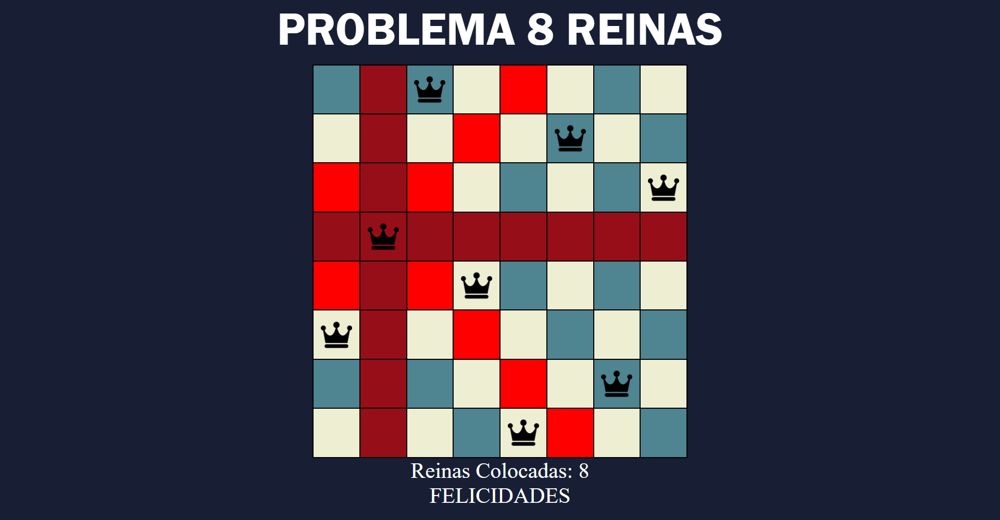

# Problema de las 8 Reinas

## Creador

- **[Antuan Carpio]** – GitHub: [@antuancarpio](https://github.com/antuancarpio)

## Descripción

Juego interactivo para el navegador basado en el clásico **problema de las 8 reinas**: colocar 8 reinas en un tablero de ajedrez de 8×8 de modo que ninguna pueda atacar a otra. Es decir, no puede haber dos reinas en la misma fila, la misma columna ni la misma diagonal.

### ¿Cómo se juega?

- **Colocar una reina:** haz clic en una casilla libre.
- **Quitar una reina:** haz clic sobre una reina ya colocada.
- **Ver los ataques:** al pasar el mouse sobre una casilla se resaltan en rojo su fila, su columna y sus dos diagonales.
- **Casillas bloqueadas:** al colocar una reina, las casillas que ella ataca dejan de aceptar clics.
- **Contador:** muestra cuántas reinas llevas colocadas.
- **Victoria:** al colocar las 8 reinas aparece el mensaje de felicitación.

## Tecnologías

- HTML5
- CSS3
- JavaScript

## Instrucciones de uso

No requiere instalación ni configuración. Solo necesitas un navegador web.

1. Descarga el proyecto o clónalo:
2. Entra a la carpeta del proyecto.
3. Abre el archivo `8reinas.html` en tu navegador (doble clic o arrastrándolo a una ventana del navegador).

## Imágenes

